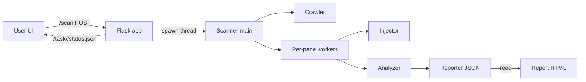

# Web Vulnerability Scanner – Final Presentation

Subtitle: Fast, Auto‑crawl Scanner with SQLi/XSS detection and rich HTML reporting
Team: Aniket Bansod (and team)
Date: Nov 2025

---

## 1. Title & tagline (Slide 1)

- Building a practical web vulnerability scanner
- Faster scans • Automated crawl depth • Clear, actionable reports
- Tech: Python, Flask, Requests, ThreadPoolExecutor

Speaker notes

- 1–2 lines about the motivation: find common web vulns quickly and explainable.

---

## 2. Problem & goals (Slide 2)

Problem statement

- Security testing is often slow, noisy, and hard to read. Student teams need a tool that can crawl a target, detect common issues (SQLi/XSS), and produce a clear, shareable report.

Objectives

- Crawl a target site safely and automatically.
- Detect reflected XSS and SQLi in forms/params; flag missing security headers.
- Optimize for speed and usability (auto depth, concurrency, pooled HTTP).
- Deliver a clean web UI with live task status and a rich report view.

Success criteria

- End‑to‑end run on a known vulnerable site produces findings with evidence.
- Scan runs faster than naive sequential baselines.
- Report summarizes severities, affected pages, and types with filters.

---

## 3. Agenda (Slide 3)

- Architecture & flow
- Components & files
- Detection methods
- UX/UI walkthrough
- Performance & tuning
- Demo
- Results, limitations, roadmap
- Q&A

---

## 4. Architecture overview (Slide 4)

- Frontend: Flask web app (landing, task status/poll, report viewer)
- Scanner: Modular Python package (crawler → injector → analyzer → reporter)
- Storage: JSON reports written to `webapp/reports/` and rendered as HTML
- Concurrency: ThreadPoolExecutor; HTTP connection pooling

Diagram (conceptual)



Speaker notes

- We decouple UI from scanning with a background thread and a JSON status endpoint.

---

## 5. System flow (Slide 5)

1. User submits target URL on landing page.
2. Flask enqueues a background scan (auto depth=2, max_pages=50) and shows a task page with loader/shimmer.
3. Task page polls `/task/<task_id>/status.json`; when ready, it redirects to the report.
4. Scanner crawls same‑origin pages (BFS), fuzzes params, tests forms, analyzes responses.
5. Reporter writes `report_<task_id>.json`; viewer renders aggregates and filters.

---

## 6. Components & files (Slide 6)

Scanner (in `scanner/`)

- `main.py` – Orchestrates crawl → per‑page scan (ThreadPoolExecutor) → analyze → JSON report; CLI entry.
- `requester.py` – HTTP session with retries + increased pool size for throughput.
- `injector.py` – Sends payloads into query/form params (SQLi/XSS), synthetic GET fuzzing when no params.
- `analyzer.py` – Parses responses for reflections, SQL errors/heuristics, security headers checks.
- `form_tester.py` – Form discovery and submission helpers.
- `input_handler.py`, `signatures.py`, `reporter.py` – Input parsing, regex signatures, JSON report writing.

Web UI (in `webapp/`)

- `app.py` – Flask routes: index, task status JSON, report view; launches scans in a thread; enriches severities/aggregates.
- `templates/` – `index.html` (hero + recent reports), `task.html` (spinner + shimmer + auto‑redirect), `report.html` (summary cards, filters, table).
- `static/style.css` – Base styles for pages.
- `reports/` – Generated JSON reports; linked from the UI.

---

## 7. Endpoints (Slide 7)

- `GET /` – Landing + form (only URL input; crawl depth auto=2)
- `POST /scan` – Starts background scan; redirects to task page
- `GET /task/<id>` – Loader page with progress bar and shimmer
- `GET /task/<id>/status.json` – JSON status for polling {status, report_url}
- `GET /report/<id>` – Rich HTML report
- `GET /reports/<file>.json` – Raw JSON download

---

## 8. Crawling strategy (Slide 8)

- Same‑origin BFS crawl; respects max_pages (default 50)
- Auto depth defaults to 2 when not specified (removed from UI)
- Deduplicates normalized URLs; handles query param variants
- Seeds per‑page worker jobs for analysis (parallel)

Edge cases

- Redirects and 4xx/5xx skipped but noted
- Binary or oversized responses avoided for analysis

---

## 9. Detection methods – SQL Injection (Slide 9)

What we test

- Parameter tampering in query/form fields with SQL meta‑characters
- Error‑based SQLi: database error regex signatures
- Heuristic length/structure deltas to flag likely injection behavior

Evidence captured

- Request URL/params, payload used
- Error snippet or anomaly details
- Affected page

Limitations

- Blind/time‑based SQLi not implemented (future work)

---

## 10. Detection methods – Reflected XSS (Slide 10)

What we test

- Inject unique markers in params/fields; check raw response reflection

Heuristics

- Case‑insensitive substring search with HTML context awareness where possible

Evidence captured

- Payload used; the response segment containing the reflection; page URL

Limitations

- DOM‑based XSS (JS‑executed) not covered yet (needs headless browser)

---

## 11. Security headers analysis (Slide 11)

Headers checked (informational)

- Content‑Security‑Policy (CSP)
- X‑Frame‑Options (XFO)
- X‑Content‑Type‑Options (XCTO)
- Referrer‑Policy
- Permissions‑Policy
- Strict‑Transport‑Security (HSTS for HTTPS)

Outcome

- Generates `Header-Missing` informational findings to guide hardening

---

## 12. Performance optimizations (Slide 12)

- Per‑page parallelism via ThreadPoolExecutor (workers configurable, default 8)
- HTTP connection pooling: increased `pool_connections` and `pool_maxsize`
- Reduced blocking I/O with retries and timeouts
- Synthetic GET fuzzing to avoid empty pages wasting cycles

Impact (qualitative)

- Noticeably faster than sequential baseline; smoother UI via background thread + polling

---

## 13. UX/UI highlights (Slide 13)

Landing page

- Clean hero, single URL field, primary CTA, recent reports list with view/download links

Task page

- Spinner + animated progress; shimmer skeleton; auto‑redirect when ready via `/status.json`

Report page

- Summary cards (total, by severity, unique pages)
- Type chips; client‑side filters (search/severity/type)
- Table with severity badges, affected URL, evidence snippet, payload

---

## 14. Data model – Report JSON (Slide 14)

Each finding

- `type`: SQLi, XSS, Header‑Missing
- `severity`: High | Medium | Low | Info
- `url`: affected page
- `parameter`/`header`: where applicable
- `payload`/`details`: evidence
- `timestamp`

Aggregates (for UI)

- Counts by severity and type
- Unique affected pages

---

## 15. Setup & run (Slide 15)

Prereqs

- Python 3.10+

Install & run (Windows PowerShell)

```powershell
# from repo root
cd vuln_scanner
python -m venv .venv
. .venv\Scripts\Activate.ps1
pip install -r requirements.txt
# start web UI
python webapp/app.py
```

Open: http://127.0.0.1:5001

CLI (optional)

```powershell
python -m scanner.main --url http://testphp.vulnweb.com --max-pages 50 --workers 8
```

---

## 16. Demo plan (Slide 16)

- Start web app; navigate to landing page
- Enter: `http://testphp.vulnweb.com`
- Show task loader (spinner + shimmer), status JSON in Network tab (optional)
- Auto‑redirect to report; walk through summary cards and filters
- Open JSON via download link; show raw finding structure

Checkpoints

- Findings include XSS/SQLi samples and header notices
- UI filters change table contents live

---

## 17. Results & interpretation (Slide 17)

How to read the report

- Start with severity distribution; inspect High/Medium first
- Review evidence snippets and payloads; confirm on target if needed
- Use type chips to triage by category

Demo target tips

- `testphp.vulnweb.com` is intentionally vulnerable and returns illustrative results

---

## 18. Limitations & roadmap (Slide 18)

Limitations

- No DOM‑based XSS (needs headless browser)
- No blind/time‑based SQLi
- No auth/session workflows or CSRF handling

Roadmap

- Headless browser engine for DOM XSS (Playwright/Puppeteer)
- Time‑based SQLi probes and response timing analysis
- Auth flows, CSRF‑aware submissions, SPA/JSON form discovery
- CWE/OWASP mapping and remediation guidance in UI
- CI integration and HTML/PDF export

---

## 19. Ethics & legal (Slide 19)

- Only scan targets you own or have written permission to test
- Respect robots.txt and rate limits where applicable
- Use responsibly; educational purpose

---

## 20. Risks & mitigations (Slide 20)

Operational risks

- Rate limiting / blocking –
  - Mitigation: retries, timeouts, optional throttle; cap max_pages
- Long scans on large sites –
  - Mitigation: same‑origin scope + depth cap; worker/timeout tuning
- False positives –
  - Mitigation: conservative signatures; allow manual verification

---

## 21. Q&A prompts (Slide 21)

Anticipated questions

- How do you avoid scanning external domains? (same‑origin checks)
- What about DOM XSS and blind SQLi? (roadmap)
- How scalable is it? (workers, pooling; can distribute per‑page)
- Can we export PDF? (JSON available; add HTML→PDF as future work)
- How do you set severity? (type‑based mapping + evidence)

---

## 22. Backup – Key code references (Slide 22)

- `scanner/main.py` – `scan_target`, `_scan_single_page`, `main()`
- `scanner/analyzer.py` – `analyze_security_headers`, XSS/SQLi analyzers
- `scanner/requester.py` – `create_session(pool_size=20)`
- `webapp/app.py` – routes, status JSON, severity enrichment
- `templates/` – `index.html`, `task.html`, `report.html` (filters, badges)

---

## 23. Backup – Config & tuning (Slide 23)

- Depth: auto=2 (can adjust in code/CLI)
- Max pages: default 50; CLI flag
- Workers: default 8; CLI flag
- Timeouts/retries: set in `requester.py`

---

## 24. Backup – Troubleshooting (Slide 24)

- 5001 already in use → change port in `webapp/app.py`
- No findings → try a known vulnerable target; increase max_pages
- SSL issues → use http:// for demo targets
- Virtual env issues → re‑activate `.venv` or reinstall reqs

---

## 25. Thank you (Slide 25)

- Links: JSON reports under `webapp/reports`
- Repo structure: `scanner/*`, `webapp/*`
- Contact: Aniket Bansod

Speaker notes

- Invite questions; optionally show raw JSON for one finding.
